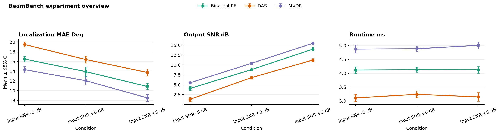

# BeamBench

[](https://github.com/WonderfulClaire/BeamBench/actions/workflows/ci.yml)
[](https://www.python.org/)
[](LICENSE)

**Reproducible experiment utilities for beamforming and spatial audio.**  
从实验 CSV 到论文图表，一条命令。

BeamBench packages the small, repetitive jobs around audio experiments: validate result
tables, aggregate repeated runs, compare methods to a baseline, and export reviewable charts
and Markdown reports. It is deliberately not another experiment-tracking server—your results
stay as ordinary files that work with Git.



## Why this exists

Research code often produces correct numbers but fragile evidence: columns drift, seeds stop
matching, error bars are computed differently across notebooks, and the final figure cannot be
recreated six weeks later. BeamBench gives those steps one small, inspectable contract.

## Quick start

```bash
python -m pip install -e .
beambench summarize examples/demo_results.csv --output report --baseline DAS
```

The output directory contains:

- `summary.csv` — mean, standard deviation, SEM, and 95% confidence interval;
- `comparisons.csv` — seed-aligned improvements and win rates versus the baseline;
- `overview.png` — consistent, presentation-ready metric panels;
- `report.md` — an auditable summary that links the artifacts together.

See the checked-in [demo report](docs/demo-report/report.md).

## The tidy result contract

Each row is one measured metric from one run:

| column | meaning |
| --- | --- |
| `run_id` | stable identifier for one method/seed/condition run |
| `method` | algorithm or model name |
| `metric` | metric name and unit, e.g. `output_snr_db` |
| `value` | numeric measurement |
| `seed` | integer repetition identifier |
| `condition` | human-readable experimental condition |

Extra columns are preserved, so dataset version, microphone layout, checkpoint, commit SHA, and
hardware metadata can travel beside the required fields.

## Python API

```python
from beambench import load_results, summarize_results, compare_to_baseline

results = load_results("results/*.csv")
summary = summarize_results(results)
comparison = compare_to_baseline(
    results,
    baseline="DAS",
    higher_is_better={"localization_mae_deg": False},
)
```

Signal helpers for repeated preprocessing live in `beambench.preprocessing`: RMS normalization,
silence trimming, and deterministic framing.

## Scope and scientific boundaries

- The bundled CSV is **deterministic synthetic demo data**, not a benchmark claim.
- Confidence intervals are descriptive normal approximations; choose an analysis appropriate to
  your study design before publication.
- Metric direction uses a naming heuristic. Pass an explicit `higher_is_better` map in serious use.
- BeamBench does not replace data/version control or a preregistered statistical plan.

## Roadmap

- [ ] Experiment manifest with Git commit and environment capture
- [ ] Bootstrap confidence intervals and multiple-comparison helpers
- [ ] LaTeX table export and journal style presets
- [ ] HearWeave example adapter for smart wearable audio experiments

Contributions are welcome—especially small adapters that remove real work without hiding the
underlying data. Start with [CONTRIBUTING.md](CONTRIBUTING.md).

