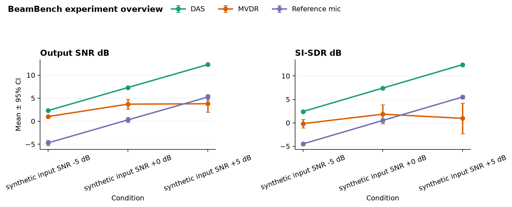

# BeamBench experiment report

> Generated from a validated tidy-results table. Statistical summaries are descriptive;
> this report does not claim significance or replace a preregistered analysis plan.

## Dataset

- Measurements: **90**
- Methods: **3**
- Metrics: **2**
- Conditions: **3**
- Baseline: **Reference mic**



## Aggregated results

| metric | method | condition | n | mean | std | sem | ci95 |
| --- | --- | --- | --- | --- | --- | --- | --- |
| output_snr_db | DAS | synthetic input SNR +0 dB | 5 | 7.303 | 0.1527 | 0.06827 | 0.1338 |
| output_snr_db | DAS | synthetic input SNR +5 dB | 5 | 12.28 | 0.1525 | 0.0682 | 0.1337 |
| output_snr_db | DAS | synthetic input SNR -5 dB | 5 | 2.31 | 0.1527 | 0.06828 | 0.1338 |
| output_snr_db | MVDR | synthetic input SNR +0 dB | 5 | 3.707 | 1.247 | 0.5575 | 1.093 |
| output_snr_db | MVDR | synthetic input SNR +5 dB | 5 | 3.789 | 2.114 | 0.9455 | 1.853 |
| output_snr_db | MVDR | synthetic input SNR -5 dB | 5 | 1.013 | 0.3262 | 0.1459 | 0.2859 |
| output_snr_db | Reference mic | synthetic input SNR +0 dB | 5 | 0.2864 | 0.6363 | 0.2846 | 0.5577 |
| output_snr_db | Reference mic | synthetic input SNR +5 dB | 5 | 5.235 | 0.6486 | 0.2901 | 0.5685 |
| output_snr_db | Reference mic | synthetic input SNR -5 dB | 5 | -4.698 | 0.6326 | 0.2829 | 0.5545 |
| si-sdr_db | DAS | synthetic input SNR +0 dB | 5 | 7.406 | 0.1654 | 0.07396 | 0.145 |
| si-sdr_db | DAS | synthetic input SNR +5 dB | 5 | 12.39 | 0.1663 | 0.07435 | 0.1457 |
| si-sdr_db | DAS | synthetic input SNR -5 dB | 5 | 2.415 | 0.1633 | 0.07303 | 0.1431 |
| si-sdr_db | MVDR | synthetic input SNR +0 dB | 5 | 1.849 | 2.323 | 1.039 | 2.036 |
| si-sdr_db | MVDR | synthetic input SNR +5 dB | 5 | 0.9593 | 3.722 | 1.665 | 3.263 |
| si-sdr_db | MVDR | synthetic input SNR -5 dB | 5 | -0.1659 | 1.008 | 0.4507 | 0.8834 |
| si-sdr_db | Reference mic | synthetic input SNR +0 dB | 5 | 0.5151 | 0.3908 | 0.1748 | 0.3425 |
| si-sdr_db | Reference mic | synthetic input SNR +5 dB | 5 | 5.511 | 0.4005 | 0.1791 | 0.351 |
| si-sdr_db | Reference mic | synthetic input SNR -5 dB | 5 | -4.482 | 0.3758 | 0.1681 | 0.3294 |

## Paired baseline comparison

Positive `delta_mean` means the candidate improved over the baseline. Direction is inferred
from common metric names and can be overridden through the Python API.

| metric | method | baseline | condition | pairs | delta_mean | delta_std | win_rate |
| --- | --- | --- | --- | --- | --- | --- | --- |
| output_snr_db | DAS | Reference mic | synthetic input SNR +0 dB | 5 | 7.017 | 0.6049 | 1 |
| output_snr_db | DAS | Reference mic | synthetic input SNR +5 dB | 5 | 7.047 | 0.6135 | 1 |
| output_snr_db | DAS | Reference mic | synthetic input SNR -5 dB | 5 | 7.008 | 0.6024 | 1 |
| output_snr_db | MVDR | Reference mic | synthetic input SNR +0 dB | 5 | 3.42 | 0.9512 | 1 |
| output_snr_db | MVDR | Reference mic | synthetic input SNR +5 dB | 5 | -1.446 | 1.668 | 0.2 |
| output_snr_db | MVDR | Reference mic | synthetic input SNR -5 dB | 5 | 5.711 | 0.5128 | 1 |
| si-sdr_db | DAS | Reference mic | synthetic input SNR +0 dB | 5 | 6.891 | 0.3231 | 1 |
| si-sdr_db | DAS | Reference mic | synthetic input SNR +5 dB | 5 | 6.882 | 0.328 | 1 |
| si-sdr_db | DAS | Reference mic | synthetic input SNR -5 dB | 5 | 6.896 | 0.3174 | 1 |
| si-sdr_db | MVDR | Reference mic | synthetic input SNR +0 dB | 5 | 1.334 | 2.468 | 0.8 |
| si-sdr_db | MVDR | Reference mic | synthetic input SNR +5 dB | 5 | -4.552 | 3.773 | 0.2 |
| si-sdr_db | MVDR | Reference mic | synthetic input SNR -5 dB | 5 | 4.316 | 1.237 | 1 |

## Reproduce

```bash
beambench summarize path/to/results.csv --output report --baseline "Reference mic"
```
